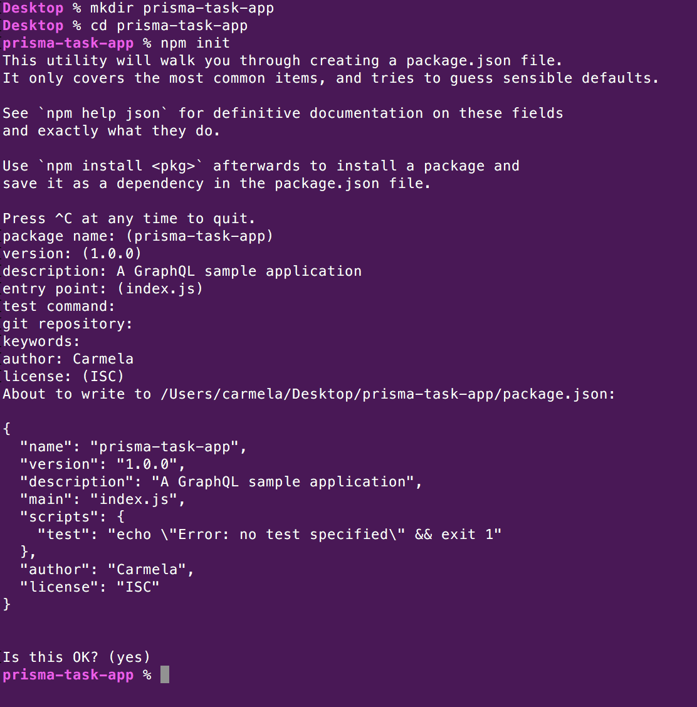

# Readme V1.0

## How to run the application

### Install the packages 
`npm install`

### Run the application
`nodemon start`

The application runs on [localhost:4000/graphql](http://localhost:4000/graphql)

### Example of GraphQL query

```
query {
    artists {
        firstName
        lastName
        artMovement
        artworks {
            title
            year
            }
    }
  }
}
```

*** 

## Introduction to pagination

This tutorial will help you to write a sample server-side GraphQL API that uses cursor-based pagination.

Nowadays, applications can manage a massive quantity of data. Still, despite the efficient and performant ways to store and manage a big amount of data, one of the main concerns is the way to present them to the final users.

A rational solution to this concern consists of __paginating the data__.
When it comes to a significant amount of data to be returned to the user, __pagination is the standard solution to divide a big dataset into sub-datasets.__
Pagination determines a limit on the number of elements to be shown to the user.
Pagination is a broad concept that applies to many circumstances, such as:

* API (both REST and GraphQL)
* Databases
* Search results coming from a serch engine 
* Messages on a messaging platform

The most common pagination methods are:
- [offset/limit pagination][offset-limit-method]
- [cursor-based pagination][cursor-based-method]

### Offset/limit pagination
This approach is based on the following values:

    * __offset:__ it's an integer and defines the position of the starting point to read the data.
    * __limit:__ it's an integer and defines the number of data items to fetch after the starting point (the offset)
  
*For example:* let's consider a request to a GraphQL API having the following pagination setting:
__?offset=10&limit=20__

The GraphQL API returns 20 data items after the 10th item.
In the following call parameters offset and limit will change in this way: 
__?offset=30&limit=20__.
The `new offset` is equal to `previous offset (10) + limit value (20)`
The *final page* is reached when the offset value exceeds the total count of data items.

#### Limitations of the Offset/Limit pagination

This approach is not the most efficient because of some intrinsic weaknesses.
The __offset/limit pagination__ is acceptable with a size-limited dataset having approximately a fixed number of items. 
The approach doesn't scale well for larger and size-variable datasets.
The method's speed is strictly related to the offset-value: *the bigger, the slower*.
When offset is really big the performance goes down because the application should go through all the elements before the offset to throw them away then and start pagination from the *offset-th* item.
Beyond the __performance issues__, there are also problems related to the __correctness of results__. It could happen that some data are received multiple times and some others are never shown. This issue is related to the order of the data and to new data. If the order is not specified and new items are added the __page-drift issue__ is the outcome.

### Cursor-based pagination
The __cursor-based pagination (also known as [Relay](https://relay.dev/docs/en/introduction-to-relay)-style pagination)__ is the solution to the limitations of the limit/offset approach.

This method handles data in chunks that start exactly after the item identified by a "cursor" and have a specific size, defined by the "first" parameter.

*For example:* a GraphQL API having a cursor-based pagination consider this kind of setting: 
__?first=5&after="cursorValueString"__ returns the first 5 items after the item having the cursor "cursorValueString".

#### Advantages of the Cursor-based pagination
From the __performance point of view__, this approach is efficient and faster. It is not tied neither the offset value nor to the dataset size.
The cursor-based approach doesn't take into consideration the already shown items, as you go ahead paginating the new results. 
It starts paginating from the cursor delimiter, just ignoring everything that stays behind it. 

***

## Prisma-task-app 
This tutorial shows how to implement a cursor-based pagination on GraphQL API. 
The javascript server-side application runs on __Node.js__ runtime and interacts with a underlying ___MySQL database__ through __Knex__ query builder. You can find the database schema file at `./server/db.sql`

## Prerequisites
1. You should have Node.js javascript runtime installed in your machine. If you don't have it installed, please go to this [link](https://nodejs.org/en/download/) to download it.
2. You should have a MySQL Database installed on your computer. In case you don't have it, please dowload it [here](https://www.mysql.com/it/downloads/)

## General setup
Create the project directory
`mkdir prisma-app-task`

Run the command to inizialize a npm package:
`npm init`

If you want to include package custom information, this is the right time. Just answer to the prompted questions.

If you want to accept the default settings, hit `Enter` and move on.

Create a new sub-directory called `server`
`mkdir server`

Now open your project with your favorite editor, some good options are:
*Sublime
*Atom
*Visual Studio Code (this one was used to create the sample)
Create a new file called `index.js` within the `server` directory.
Add to the javascript file the following function:
```
console.log("My awesome node application is running!");
```

### package.json setup
Open the package.json setup with your favorite editor and add the section  *dependencies*
```
 "dependencies": {
    "express": "^4.17.1",
    "express-graphql": "^0.9.0",
    "graphql": "^14.6.0",
    "knex": "^0.20.9",
    "mysql": "^2.18.1",
    "nodemon": "^1.3.7"
  }
```

Now change the start script to:
```
  "scripts": {
    "start": "./node_modules/.bin/nodemon server/index.js --ignore node_modules/"
  }
```

Go back to your terminal and run the `npm install` command that will install the dependencies.
You can start the application by running:
`nodemon start`

[Nodemon](https://www.npmjs.com/package/nodemon) is a package that allows the auto-refreshing of the application after a change is applied.
Your terminal should now show the message *"My awesome node application is running!"*

The general server setup is all set. Let's go to the database.

## Database setup
To setup your MySQL database, you can either choose to use the command line tool or to download a GUI.
In the first case after you 

